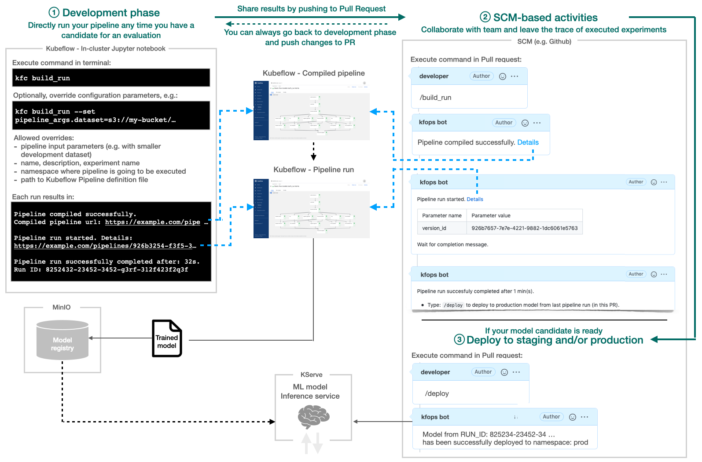
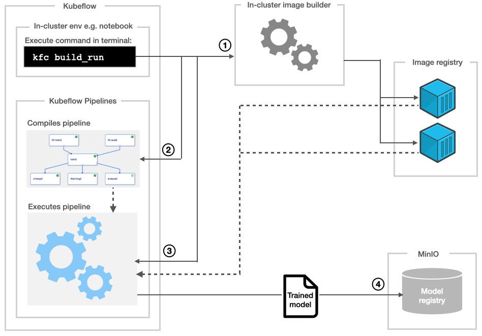
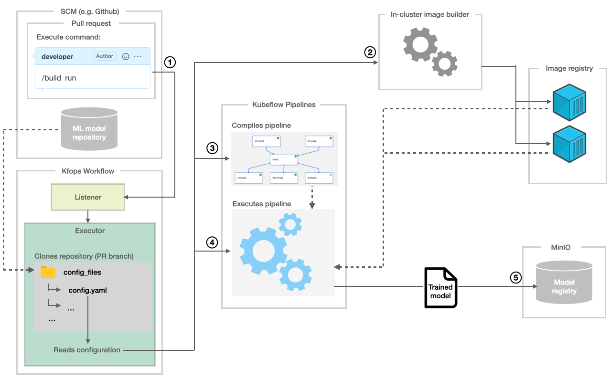

## Where does Kfops fit in the MLOps lifecycle

The high level flow ([full screen version](kfc-flow.png)):

Steps after `kfc build_run` command is executed:

Build and run in the context of Pull request:

